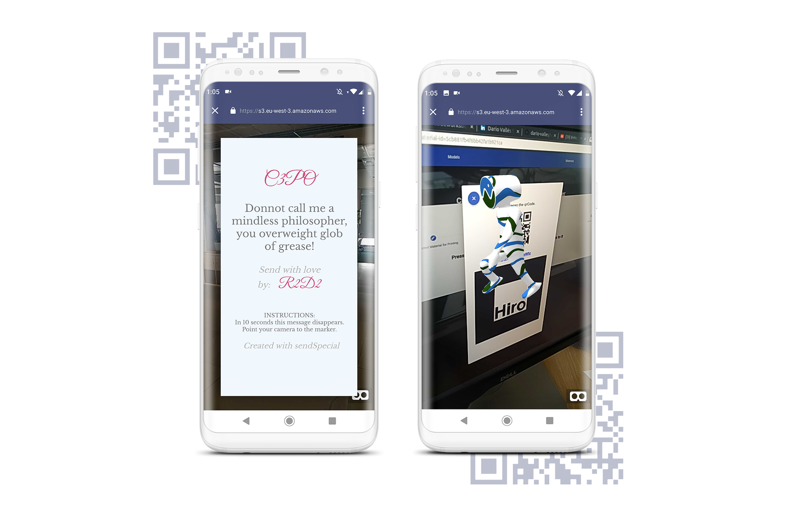

# sendSpecial

Send a special gift to whom you want.
SendSpecial let's you create a marker with custom 3d model, custom text, and custom audio.
Once created just point with your mobile to the Hiro marker and see the magic.

**Live demo at**: [sendspecial.surge.sh](sendspecial.surge.sh)

FRONTEND:

-  [Angular](https://angular.io/) - The front-end framework developed by Google
-  [Angular Material](https://material.angular.io/) - Material design components for Angular

BACKEND:

-   [Koa](https://koajs.com/)  - Back-end framework for node.js
-   [MongoDB](https://www.mongodb.com/) - A NoSQL Database
-   [Mongoose](https://mongoosejs.com/) - An object data modeling (ODM) library

LIBRARIES, FRAMEWORKS and 3rd party:

-   [A-FRAME](https://aframe.io/) - Framework for building virtual reality experiences 
-   ​[AR.js](https://github.com/jeromeetienne/AR.js) - Efficient Augmented Reality for the Web
-   [AWS S3](https://aws.amazon.com/s3/) - Amazon Simple Storage Service
-   [BITLY](https://bitly.com/) - URL Shortener

